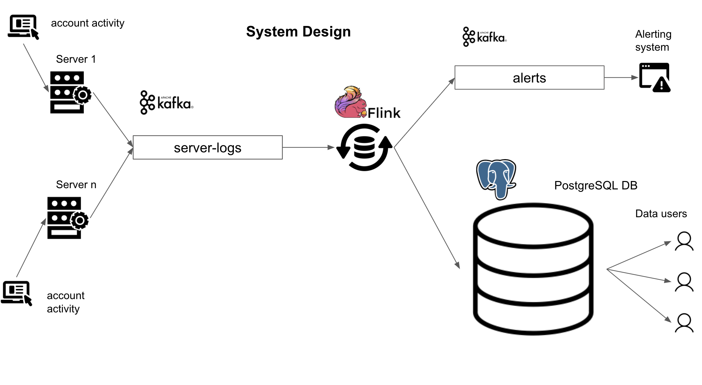

# Data Engineering Stream Pipeline: Fraud Detection Account Sharing

## What it does?
- Detect fradulent users in real time who are sharing account credentials
- Analyse different user actions of fraud accounts in real time

## Tech Stack
- Apache Flink
- Apache Kafka
- Scala
- Postgres
- AWS

## Prerequisites

You will need to install

1. [docker](https://docs.docker.com/get-docker/) (make sure to have docker-compose as well)
2. [pgcli](https://github.com/dbcli/pgcli) to connect to our `postgres` instance
3. [git](https://git-scm.com/book/en/v2/Getting-Started-Installing-Git) to clone the starter repo
4. **Optional:** [tmux](https://github.com/tmux/tmux/wiki)

# Design



# Data

The data will be generated by a data generation script at `src/main/scala/com.frauddetectionaccountsharing/ServerLogGenerator.scala`.

# Setup and run

Everything is dockerized. Run the below commands in the project directory.

```bash
docker-compose up -d # -d mean run in detached mode (in the background)
docker ps # display all running containers
```

Do some manual checks using

```bash

docker exec -t beginner_de_project_stream_kafka_1 kafka-console-consumer.sh --bootstrap-server :9092  --topic server-logs --from-beginning --max-messages 10 # used to check the first 10 messages in the server-logs  topic
docker exec -t beginner_de_project_stream_kafka_1 kafka-console-consumer.sh --bootstrap-server :9092  --topic alerts --from-beginning --max-messages 10 # used to check the first 10 messages in the alerts topic
```

and

```bash
pgcli -h localhost -p 5432 -U frauddetectionaccountsharing events
```
password is `password`

```sql
select * from server_log limit 5; -- should match the first 5 from the server-logs topic
select count(*) from server_log; -- 100000
\q -- to exit pgcli
```

take down all the running containers using down in the project repository

```bash
docker-compose down
```
